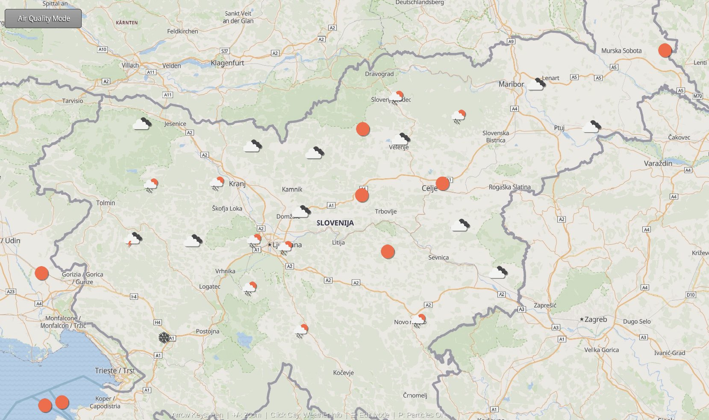
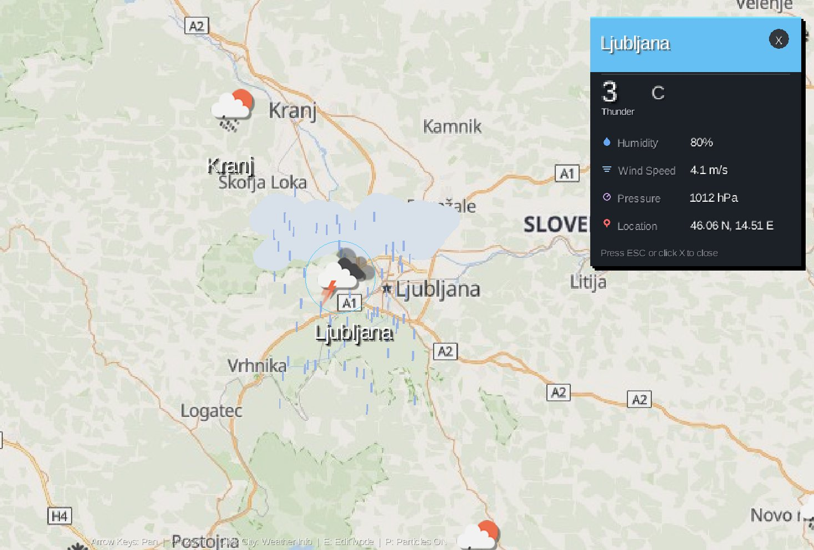

#  Interaktivni Vremenski Zemljevid Slovenije


Namizna aplikacija za vizualizacijo vremenskih podatkov in kakovosti zraka za mesta v Sloveniji, razvita z uporabo ogrodja **LibGDX** in **Java**.

---

## Opis projekta

Aplikacija prikazuje interaktivni zemljevid Slovenije z realnimi vremenskimi podatki in podatki o kakovosti zraka za slovenska mesta. Podatki se pridobivajo iz OpenWeatherMap API-ja in se prikazujejo z animiranimi ikonami, delci in informacijskimi paneli.

---

## Posnetki zaslona
**Pregled zemljevida z vremenskimi ikonami**


**Vremenski panel za izbrano mesto**


---

##  Funkcionalnosti

- **Interaktivni zemljevid zgeneriran s Geoapify** –  premikanje, povečevanje in oddaljitev z miško ali tipkovnico
- **Vremenski podatki v realnem času** – temperatura, vlažnost, tlak, hitrost vetra in opis vremena
- **Podatki o kakovosti zraka** – AQI indeks, PM2.5, ozon (O₃) in dušikov dioksid (NO₂)
- **Animirani delci** – vizualni prikaz dežja, snega, oblakov, vetra in onesnaženosti zraka
- **Informacijski panel** – animiran stranski panel z izbranimi podatki mesta
- **Način urejanja** – dodajanje, urejanje in brisanje mest
- **Predpomnilnik** – shranjevanje zemljevida in vremenskih ikon lokalno za hitrejše nalaganje
- **Statični podatki** – možnost ročnega vnosa podatkov za posamezna mesta

---

##  Tehnologije

| Komponenta | Tehnologija |
|---|---|
| Ogrodje | LibGDX |
| Jezik | Java |
| Vreme API | OpenWeatherMap |
| Zemljevid | Geoapify Static Maps API |
| Serializacija | LibGDX Json |
| UI | LibGDX Scene2D |

---


## ️ Namestitev in zagon

### Konfiguracija API ključev

Ustvari datoteko `local.properties` v korenu projekta:

```properties
OPENWEATHER_API_KEY=tvoj_api_kljuc
GEOAPIFY_API_KEY=tvoj_api_kljuc
```

### Zagon

```bash
./gradlew lwjgl3:run
```

---

